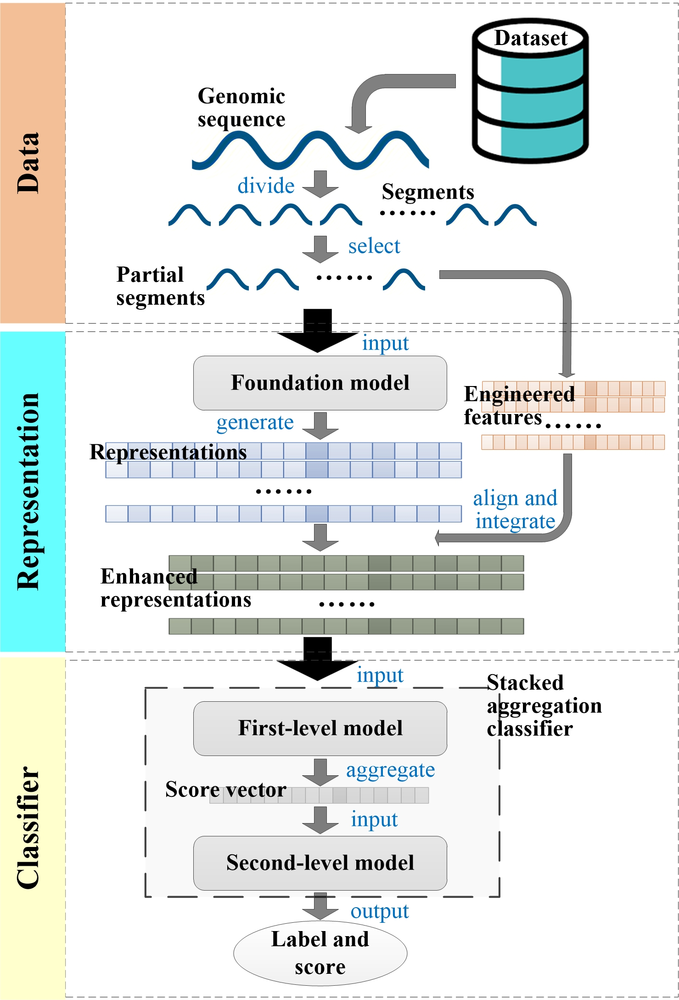

# Prediction of soil probiotics based on foundation model representation enhancement and stacked aggregation classifier

## Introduction
Soil probiotics are indispensable in agro-ecosystem, which enhances crop yield through nutrient solubilization, pathogen suppression, and soil structure improvement. However, reliable prediction methods for soil probiotics remain absent. In this study, we utilize genomic foundation models to generate representations from samples’ sequences, and then, enhance them by deeply integrating domain-specific engineered features. The enhanced representations enable training a powerful classifier for a target task, instead of common parameter fine-tuning. Inspired by the stacking ensemble learning framework, we also design a stacked aggregation classifier. It predicts the lable of a sample with only leveraging partial sequence segments from this sample, effectively addressing the challenges in processing long sequences. The proposed method is applied on prediction of soil probiotics and obtains 97.50% accuracy and 0.9807 AUC value on balanced and imbalanced test sets, respectively. Potential functional genes are revealed from the predicted probiotics, providing biologically insights for more related studies.

## Schematic Diagram
<div style="text-align: center;">
    
</div>
Figure 1. Overview of the proposed method. The genomic sequence of a bacterial sample is divided into segments. Its partial segments are input into a pre-trained foundation model to generate representations, and engineered features are extracted from these segments. The foundation model representation and engineered feature vectors are aligned, and then, the foundation model representations are enhanced by deeply integrating the engineered features. The enhanced representations are fed into the stacked aggregation classifier. The first-level classifier processes each enhanced representation to obtain a score. All scores are aggregated into a vector, which is input into the second-level classifier to output the final label and score.

## Quick Start

### Download the GitHub Repository
[Download](https://github.com/sunhaotong0605/SPP_FMRESAC/archive/refs/heads/main.zip) this GitHub repository, and extract the contents into a folder.

### Data Description
The proposed method requires data in [fasta](https://www.ncbi.nlm.nih.gov/genbank/fastaformat/) format as input. All data used will be made public as a supplementary table after the paper is accepted.

## Install
```bash
# Python environment constructed by Conda
conda create -n SPP_FMRESAC python=3.8.15
conda activate SPP_FMRESAC
git clone https://github.com/sunhaotong0605/SPP_FMRESAC.git
cd SPP_FMRESAC
pip install -r requirements.txt
```
## Usage
```bash
python main.py -m model_name -i input_file -o output_path
```
--model_name: A selected foundation model for generating representations and the candidates are "NT_50M", "DNABERT2_117M" or "EVO_7B".

--input_file: An input fasta file.

--output_path: A path for outputting files.

The output files include a representation.pkl (foundation model representations), a feature.pkl (engineered features) and an enhanced_representation.pkl (enhanced representations). The predicted label and score of the target samples are printed.

## License
MIT License. See [LICENSE](LICENSE.txt) for details.

## Citation
Kang Q, Sun H, Wang Y, et al. Prediction of soil probiotics based on foundation model representation enhancement and stacked aggregation classifier. bioRxiv. doi:
